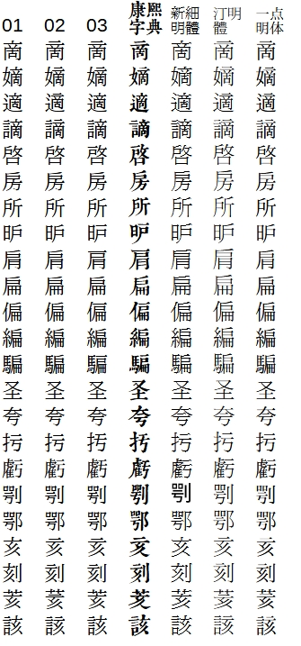
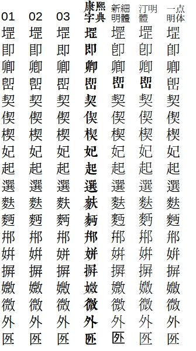
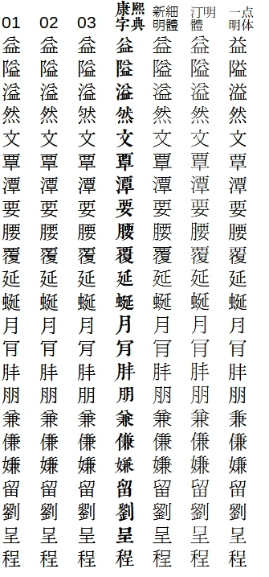
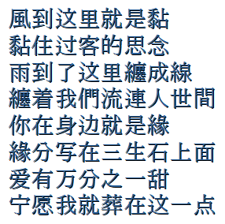
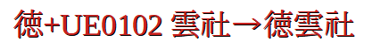

# IPAmj明朝體傳承化方案
IPAmjMincho to Classic IPAmj明朝體傳承化方案 IPAmj明朝体传承化方案。
## 适用范围
本项目适用于[IPAmj明朝](https://moji.or.jp/mojikiban/font/)以及符合[IVD_Charts_Moji_Joho.pdf(2017)](https://unicode.org/ivd/data/2017-12-12/IVD_Charts_Moji_Joho.pdf)标准的字体。
## 使用方法
运行`fontforge -script crfontff.py`。
## 版本说明
* 版本01. 参考新细明体。
* 版本02. 传承旧字综合。
* 版本03. 参考康熙字典。
## 预览
* 版本对比  
  
  
  
* 部分缺失的简化字以繁体字补全  
  
* 保留原版变体选择器  
  
## 下载字体
可从 [Releases](https://github.com/GuiWonder/IPAmjMinchoClassic/releases) 页面下载字体。
## 参考资源
* [IPAmj明朝](https://moji.or.jp/mojikiban/font/)
* [IVD 2017-12-12 Moji_Joho](https://unicode.org/ivd/data/2017-12-12/IVD_Charts_Moji_Joho.pdf)
* [GlyphWiki](https://glyphwiki.org/)
* [一点明体](https://github.com/ichitenfont/I.Ming)
